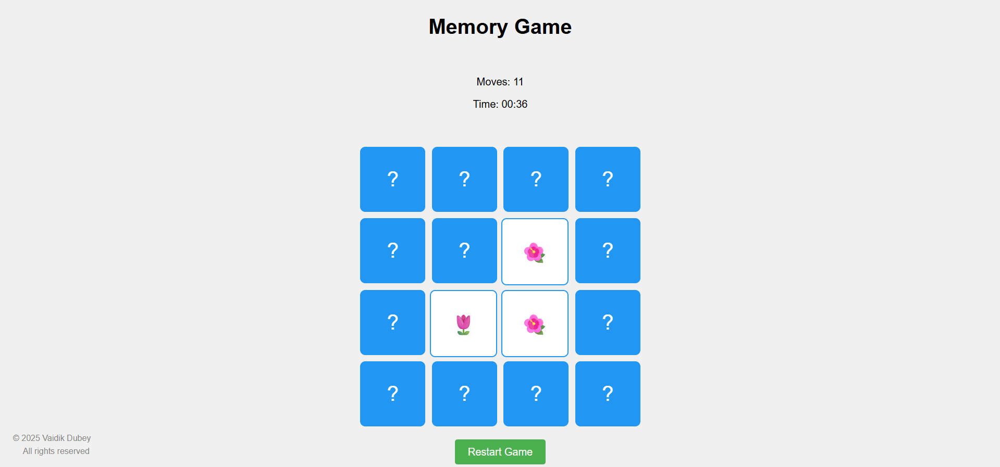

# 🧠 Memory Card Game 🎮

A fun and interactive **Memory Card Game** built using **JavaScript, HTML, and CSS**.  
The player flips two cards at a time, trying to find matching pairs, while the timer and move counter track performance.  

---

## 🚀 Features
- 🎲 **Random value generation** for cards  
- 🔀 **Fisher-Yates algorithm** for shuffling  
- ⏱️ **Timer** using `setTimeout` & `setInterval`  
- 📐 **Dynamic grid creation**  
- 🔢 **Move counter** to track attempts  
- 🔄 **Card flipping and matching logic**  
- 🎯 **Win detection** with score calculation  
- ♻️ **Reset and Restart** game state  

---

## 📸 Demo

---

## 🛠️ Tech Stack
- **HTML** – structure  
- **CSS** – styling and animations  
- **JavaScript (Vanilla JS)** – game logic & DOM manipulation  
